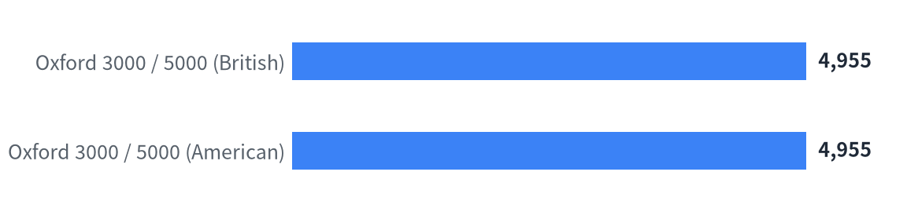
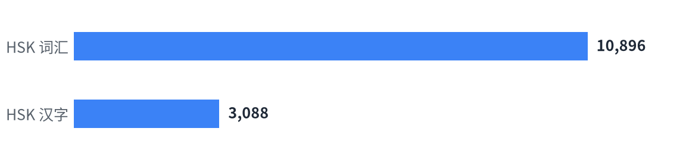

# Wordlists

**English** | [中文](README.md)

A small collection of vocabulary lists for learners of **Chinese (HSK)** and **English (Oxford)**,
extracted from official exam syllabi. Each wordlist is a plain JSON file, grouped by section.

Focused here on the internationally useful lists: **HSK** (Chinese) and **Oxford 3000 / 5000** (English).
China-specific exam lists (CET, the compulsory/high-school English curriculum) live in the same repo and are
described in the [Chinese README](README.md).

```
wordlists/
├── data/
│   ├── en/                           # English wordlists
│   │   ├── Oxford3000-5000-US.json   # Oxford 3000 / 5000 (American English)
│   │   ├── Oxford3000-5000-UK.json   # Oxford 3000 / 5000 (British English)
│   │   ├── definitions.json          # Chinese glosses + IPA (from ECDICT)
│   │   └── categories.json           # word -> [categories]
│   └── zh/                           # Chinese wordlists
│       ├── HSK词汇.json              # HSK vocabulary (pinyin + part of speech)
│       └── HSK汉字.json              # HSK characters (recognition / writing)
├── sources/{en,zh}/                  # source PDFs and raw data
├── assets/                           # generated charts
└── tools/                            # generator scripts
```

## Wordlist sizes

### English

<!-- counts-en:start -->
| List | Entries | Source |
| --- | --: | --- |
| Oxford 3000 / 5000 (British) | 4,955 | The Oxford 3000™ & 5000™ (British English) |
| Oxford 3000 / 5000 (American) | 4,955 | The Oxford 3000™ & 5000™ (American English) |

<picture>
  <source media="(prefers-color-scheme: dark)" srcset="assets/counts-en-intl-dark.png">
  
</picture>
<!-- counts-en:end -->

### Chinese

<!-- counts-zh:start -->
| List | Entries | Source |
| --- | --: | --- |
| HSK Vocabulary | 10,896 | HSK Exam Syllabus — Vocabulary |
| HSK Characters | 3,088 | HSK Exam Syllabus — Characters |

<picture>
  <source media="(prefers-color-scheme: dark)" srcset="assets/counts-zh-dark.png">
  
</picture>
<!-- counts-zh:end -->

## Format

Each file has a `_meta` block, then sections; inside a section a word maps to its data.

**Oxford 3000 / 5000** — `data/en/Oxford3000-5000-{US,UK}.json`

```json
{ "Oxford3000": { "bank": {"A1": [["n.", "money"]], "B1": [["n.", "river"]]} },
  "Oxford5000": { "abundance": {"B2": [["n."]]} } }
```

- section = `Oxford3000` / `Oxford5000`
- value = `{CEFR: [[part of speech, sense?], …]}` (`sense` disambiguates homographs)

**HSK vocabulary** — `data/zh/HSK词汇.json`

```json
{ "一级": { "爱": [["ài", "动"]], "半": [["bàn", "数"]] },
  "四级": { "半": [["bàn", "副"]] } }
```

- section = `一级` … `七—九级`
- value = `[[pinyin, part of speech], …]`; a word listed at several levels appears in each

**HSK characters** — `data/zh/HSK汉字.json`

```json
{ "一级认读字": ["爱", "八", "爸", "..."],
  "一级~二级书写字": ["爱", "八", "爸", "..."] }
```

- sections are `<level>认读字` (recognition) and `<level>书写字` (writing)

## License

This project's own work (JSON structure, processing, docs) is under the [MIT](LICENSE) license.

- Glosses and IPA in `data/en/definitions.json` come from [ECDICT](https://github.com/skywind3000/ECDICT) (MIT).
- Source PDFs under `sources/` remain the copyright of their respective publishers and are included for study
  and research only; see the [Chinese README](README.md) for details.
