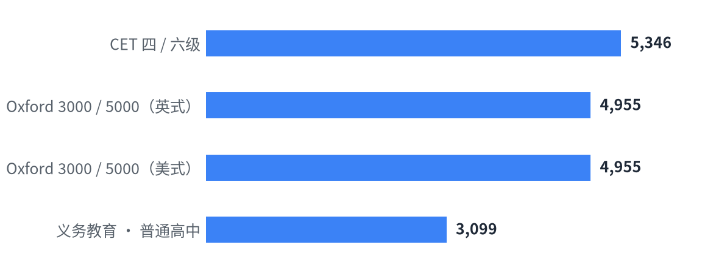

# 词库 Wordlists

```
wordlists/
├── data/       # 词库 JSON
│   ├── CET.json
│   ├── Oxford3000-5000-US.json   # Oxford（美式）
│   ├── Oxford3000-5000-UK.json   # Oxford（英式）
│   ├── 义务教育-普通高中.json
│   └── definitions.json          # 中文释义 + 音标（由 ECDICT 生成）
├── sources/    # 原始来源
│   ├── ECDICT/                   # ECDICT 原始数据（ecdict.csv, LICENSE）
│   ├── The_Oxford_3000.pdf                       # 英式
│   ├── The_Oxford_3000_by_CEFR_level.pdf
│   ├── The_Oxford_5000.pdf
│   ├── The_Oxford_5000_by_CEFR_level.pdf
│   ├── American_Oxford_3000.pdf                  # 美式
│   ├── American_Oxford_3000_by_CEFR_level.pdf
│   ├── American_Oxford_5000.pdf
│   ├── American_Oxford_5000_by_CEFR_level.pdf
│   ├── 《全国大学英语四、六级考试大纲（2016年修订版）》.pdf
│   ├── 普通高中英语课程标准日常修订版（2017年版2025年修订）.pdf
│   ├── 义务教育英语课程标准日常修订版（2022年版2025年修订）.pdf
│   └── 新版HSK考试大纲1219.pdf
├── assets/     # 生成的图表
│   ├── counts-light.png
│   └── counts-dark.png
├── tools/      # 脚本
│   ├── counts.py   # 统计 / 出图
│   ├── oxford.py   # 解析 Oxford PDF，生成两版词库
│   └── defs.py     # 生成 definitions.json
└── README.md
```

<!-- counts:start -->
| 词表 | 词条数 | 来源 |
| --- | --: | --- |
| CET 四 / 六级 | 5,346 | 《全国大学英语四、六级考试大纲（2016年修订版）》 |
| Oxford 3000 / 5000（英式） | 4,955 | The Oxford 3000™ & 5000™ (British English) |
| Oxford 3000 / 5000（美式） | 4,955 | The Oxford 3000™ & 5000™ (American English) |
| 义务教育 · 普通高中 | 3,099 | 《普通高中英语课程标准（2017年版2025年修订）》 |

<picture>
  <source media="(prefers-color-scheme: dark)" srcset="assets/counts-dark.png">
  
</picture>
<!-- counts:end -->

## 释义

`data/definitions.json` 收录上面四个词表的**去重词条**（7,008 个），给出**音标**和**中文释义**。
释义取自 [ECDICT](https://github.com/skywind3000/ECDICT)（MIT License），原始数据在 `sources/ECDICT/ecdict.csv`。

每个词的格式为 `[音标, [[头, [释义…]], …]]`：

```json
"abandon": ["ә'bændәn", [["vt.", ["放弃, 抛弃, 遗弃, 使屈从, 沉溺, 放纵"]], ["n.", ["放任, 无拘束, 狂热"]]]],
"bank":    ["bæŋk", [["n.", ["银行, 堤, 岸"]], ["[医]", ["库"]]]],
"run":     ["rʌn", [["n.", ["跑, …"]], ["vi.", ["跑, …"]], ["vt.", ["使跑, …"]], ["a.", ["熔化的, …"]], ["其它", ["run的过去式和过去分词"]], ["[计]", ["运行"]]]]
```

- **头**按 ECDICT 释义行的行首判断：
  - 词性（`vt.` `vi.` `n.` `a.` `adv.` …）原样保留；
  - `vt.vi.` / `vi.vt.`（及物、不及物均可）归为 `v.`；
  - 领域标签（`[计]` `[医]` `[法]` `[经]` `[化]` …）原样保留；
  - 两者都没有的归入 `其它`。
- 行内出现的方括号（如 `交感[作用]`、`[疾]病`）保留在释义正文里，不拆。
- 未做清洗，专业领域义项、`run的过去式和过去分词` 之类的说明行都原样保留。
- `_meta.pos_map` 给出与 Oxford 词性口径的对照（`vt.`/`vi.`→`v.`、`a.`→`adj.`、`num.`→`number` …），方便和 `Oxford3000-5000-US.json` / `-UK.json` 对表。

重新生成：

```bash
uv run tools/oxford.py         # 从 sources/ 的 Oxford PDF 重新生成两版词库
uv run tools/defs.py           # 读取 sources/ECDICT/ecdict.csv，刷新 data/definitions.json
uv run tools/defs.py --check   # 只报告覆盖情况，不写文件
```

## 许可 License

本项目自行整理的部分（JSON 数据结构、数据处理、文档）采用 [MIT](LICENSE) 许可证。

- `data/definitions.json` 的释义与音标来自 [ECDICT](https://github.com/skywind3000/ECDICT)，采用 MIT 许可证。
- `sources/` 中的 PDF 及其中词表内容的版权归原作者 / 出版机构所有
  （如 The Oxford 3000/5000 归 Oxford University Press，课程标准和考试大纲归相应教育机构），
  本项目仅出于学习研究目的收录，不主张任何权利。如需商用，请自行向权利人获取授权。
