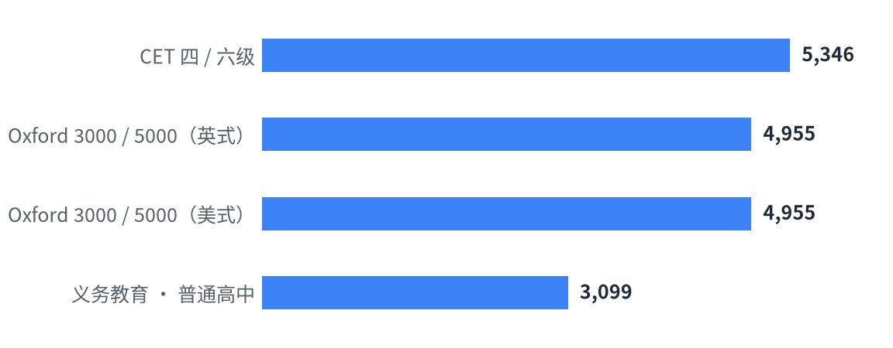

# 词库 Wordlists

[English](README.en.md) | **中文**

```
wordlists/
├── data/       # 词库 JSON
│   ├── en/     # 英文词表
│   │   ├── CET.json
│   │   ├── Oxford.json               # Oxford（美式 & 英式）
│   │   ├── 义务教育-普通高中.json
│   │   ├── definitions.json          # 英文释义 + 音标（ECDICT）
│   │   └── categories.json           # 英文词 -> [类别]
│   └── zh/     # 中文词表
│       ├── HSK词汇.json              # HSK 词汇大纲
│       └── HSK汉字.json              # HSK 汉字大纲
├── sources/    # 原始来源
│   ├── en/
│   │   ├── ECDICT/                               # ECDICT 原始数据（ecdict.csv, LICENSE）
│   │   ├── The_Oxford_3000.pdf                   # 英式
│   │   ├── The_Oxford_5000.pdf
│   │   ├── American_Oxford_3000.pdf              # 美式
│   │   ├── American_Oxford_5000.pdf
│   │   ├── 《全国大学英语四、六级考试大纲（2016年修订版）》.pdf
│   │   ├── 普通高中英语课程标准日常修订版（2017年版2025年修订）.pdf
│   │   └── 义务教育英语课程标准日常修订版（2022年版2025年修订）.pdf
│   └── zh/
│       └── 新版HSK考试大纲1219.pdf
├── assets/     # 生成的图表
│   ├── counts-en-light.png
│   ├── counts-en-dark.png
│   ├── counts-zh-light.png
│   └── counts-zh-dark.png
├── tools/      # 脚本
│   ├── counts.py     # 统计 / 出图
│   ├── oxford.py     # 解析 Oxford PDF，生成两版词库
│   ├── defs.py       # 生成 definitions.json
│   ├── categories.py # 生成 categories.json
│   └── hsk.py        # 解析 HSK PDF，生成词汇/汉字
└── README.md
```

## 词表规模

### 英文

<!-- counts-en:start -->
| 词表 | 词条数 | 来源 |
| --- | --: | --- |
| CET 四 / 六级 | 5,346 | 《全国大学英语四、六级考试大纲（2016年修订版）》 |
| Oxford 3000 / 5000 | 5,062 | The Oxford 3000™ & 5000™（美式 & 英式） |
| 义务教育 · 普通高中 | 3,099 | 《普通高中英语课程标准（2017年版2025年修订）》 |

<picture>
  <source media="(prefers-color-scheme: dark)" srcset="assets/counts-en-dark.png">
  
</picture>
<!-- counts-en:end -->

### 中文

<!-- counts-zh:start -->
| 词表 | 词条数 | 来源 |
| --- | --: | --- |
| HSK 词汇 | 10,896 | 《HSK 考试大纲》词汇大纲 |
| HSK 汉字 | 3,088 | 《HSK 考试大纲》汉字大纲 |

<picture>
  <source media="(prefers-color-scheme: dark)" srcset="assets/counts-zh-dark.png">
  
</picture>
<!-- counts-zh:end -->

## 词库格式

各词库按「段」分节：顶层是段名，段内是 `单词 -> 数据`。

| 文件 | 段 | 每词的值 |
| --- | --- | --- |
| `CET.json` | `CET4` / `CET6` | `[派生词, 拼写变体]` |
| `Oxford.json` | `Oxford3000` / `Oxford5000` | `{CEFR: [[词性, 同形区分?, 版本?], …]}` |
| `义务教育-普通高中.json` | `义务教育` / `必修` / `选择性必修` | `[其他形式]` |
| `HSK词汇.json` | `一级`…`七—九级` | `[[拼音, 词性], …]` |
| `HSK汉字.json` | `一级认读字`…`七—九级书写字` | `[汉字, …]` |

- 同时在多段的词会在各段各出现一次（如 CET 的 4 个四级六级共有词）。
- Oxford 记录第 3 位为版本（`US`/`UK`），缺省表示美英相同；美式与英式已合并为一个文件。
- 「普通高中 = 必修 + 选择性必修」的分组写在 `_meta.groups`。
- 每个文件的 `_meta.format` 也都有说明。

## 类别索引

`data/categories.json` 汇总所有词库的类别，结构为 `词 -> [类别, …]`：

```json
"bank":    ["CET4", "Oxford3000", "义务教育", "A1", "B1"],
"analyse": ["Oxford3000", "选择性必修", "B1"],
"analyze": ["CET4", "Oxford3000", "A2"]
```

- 类别：`CET4` `CET6` `Oxford3000` `Oxford5000` `义务教育` `必修` `选择性必修` `A1`–`C1`
- Oxford 区分美式 `-US` / 英式 `-UK`；CEFR 也计入类别。

## 释义

`data/definitions.json` 收录上面四个英文词表的**去重词条**（7,008 个），给出**音标**和**中文释义**。
释义取自 [ECDICT](https://github.com/skywind3000/ECDICT)（MIT License），原始数据在 `sources/ECDICT/ecdict.csv`。
（ECDICT 为英汉词典，**不含 HSK 中文词/字**。）

每个词的格式为 `[音标, [[头, [释义…]], …]]`：

```json
"abandon": ["ә'bændәn", [["vt.", ["放弃, 抛弃, 遗弃, 使屈从, 沉溺, 放纵"]], ["n.", ["放任, 无拘束, 狂热"]]]],
"bank":    ["bæŋk", [["n.", ["银行, 堤, 岸"]], ["[医]", ["库"]]]],
"run":     ["rʌn", [["n.", ["跑, …"]], ["vi.", ["跑, …"]], ["vt.", ["使跑, …"]], ["a.", ["熔化的, …"]], ["其它", ["run的过去式和过去分词"]], ["[计]", ["运行"]]]]
```

- **头**按 ECDICT 释义行的行首判断：
  - 词性（`vt.` `vi.` `n.` `a.` `adv.` …）原样保留；
  - `vt.vi.` / `vi.vt.`（及物、不及物均可）归为 `v.`；
  - 领域标签（`[计]` `[医]` `[法]` `[经]` `[化]` …）原样保留；
  - 两者都没有的归入 `其它`。
- 行内出现的方括号（如 `交感[作用]`、`[疾]病`）保留在释义正文里，不拆。
- 未做清洗，专业领域义项、`run的过去式和过去分词` 之类的说明行都原样保留。
- `_meta.pos_map` 给出与 Oxford 词性口径的对照（`vt.`/`vi.`→`v.`、`a.`→`adj.`、`num.`→`number` …），方便和 `Oxford.json` 对表。

重新生成：

```bash
uv run tools/oxford.py         # 从 sources/ 的 Oxford PDF 重新生成两版词库
uv run tools/defs.py           # 读取 sources/ECDICT/ecdict.csv，刷新 data/definitions.json
uv run tools/defs.py --check   # 只报告覆盖情况，不写文件
uv run tools/categories.py     # 刷新 data/categories.json
uv run tools/hsk.py            # 从 sources/ 的 HSK PDF 生成 data/HSK词汇.json、HSK汉字.json
```

## 许可 License

本项目自行整理的部分（JSON 数据结构、数据处理、文档）采用 [MIT](LICENSE) 许可证。

- `data/definitions.json` 的释义与音标来自 [ECDICT](https://github.com/skywind3000/ECDICT)，采用 MIT 许可证。
- `sources/` 中的 PDF 及其中词表内容的版权归原作者 / 出版机构所有
  （如 The Oxford 3000/5000 归 Oxford University Press，课程标准和考试大纲归相应教育机构），
  本项目仅出于学习研究目的收录，不主张任何权利。如需商用，请自行向权利人获取授权。
